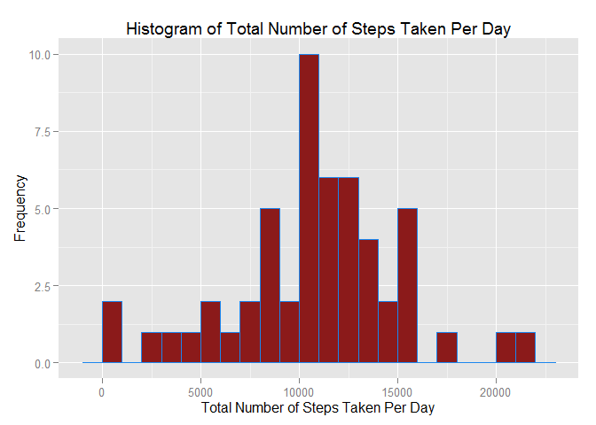
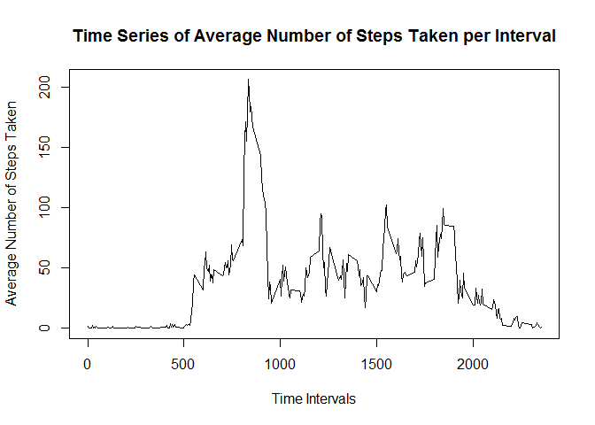
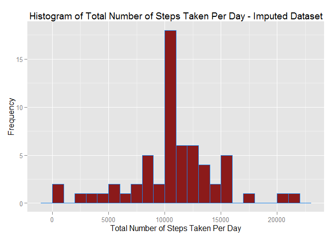
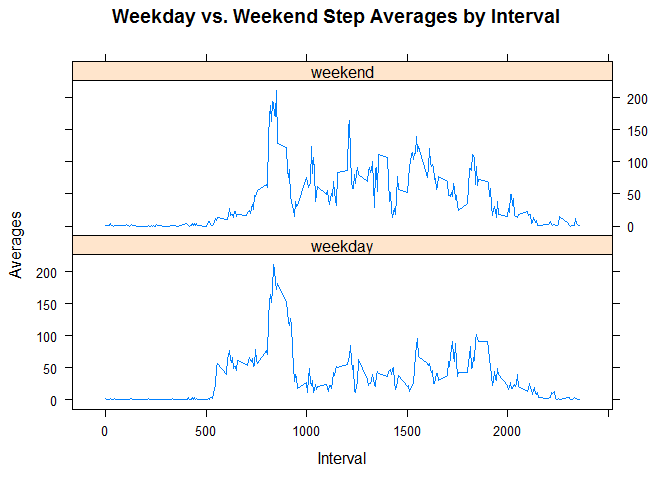

Reproducible Research - Project 1
=========================================

### Loading and preprocessing the data

Here's how to load the dataset into R, and to check if there is any necessary transformation needed.
Since the file contains comma separated values (csv), **read.csv()** function is used. 
We would like to have the data in a long form, where observations are represented by a row and each column has a meaningful name. It is useful to use **head()**, **dim()** and **names()** functions to understand the basics of the dataset.


```r
        unzip(zipfile="activity.zip")
        myDataset <- read.csv("activity.csv")
        head (myDataset)
```

```
##   steps       date interval
## 1    NA 2012-10-01        0
## 2    NA 2012-10-01        5
## 3    NA 2012-10-01       10
## 4    NA 2012-10-01       15
## 5    NA 2012-10-01       20
## 6    NA 2012-10-01       25
```

```r
        names (myDataset)
```

```
## [1] "steps"    "date"     "interval"
```

From the output of the code above, we can conclude that the data is in the long format and it has meaningful column names. One important feature of the dataset that should be noted is that missing values are coded as "NA". Therefore, any further calculation may require the removal of these NA values.

### What is the mean total number of steps taken per day?

This section is divided into three categories. Each category is summarizing the solutions to each question asked in the project outline. 

#### Step 1: Calculate the total number of steps taken per day

In order to calculate the total number of steps taken per day, the steps described below should be followed:

1. To calculate the total number of steps taken in each day, we need to be able to access to the dates. Therefore, first the date column needs to be converted into POSIXct object. This can be done by **ymd()** function from package **lubridate**. 

2. Next, the NA values in **steps** column should be removed before any further calculation.The new subset of data is stored in **myDataset_NArm**. 

3. Finally, **sapply()** function can be used to apply the **sum()** function to the steps taken in each day. In **sapply()** function, first, dataset is split according to the dates with **split()** function, then **sum()** function is applied. The resulting vector is stored in a dataframe called **mySum** with the help of **data.frame()** function. 

4. In order to make the mySum() dataframe more meaningful, the column name and row names are rewritten. For row names, since the year is same for all the oberservations, it is omitted.
Instead month label and the day is used for each day. 

        * Month label is added by using __month()__ function from lubridate package.
        
        * The day and month are pasted together to appear in the row names with __paste()__ function.


```r
        library (lubridate)      
        myDataset$date <- ymd(myDataset$date)
        myDataset_NArm <- myDataset [which (myDataset$steps != "NA"), ]
        mySum <- data.frame (sapply(split(myDataset_NArm$steps, myDataset_NArm$date), sum))
        colnames(mySum) <- "Total Number of Steps Per Day"
        rownames(mySum) <- unique(paste (month (myDataset_NArm$date, label = TRUE) , day (myDataset_NArm$date)))        
        mySum 
```

```
##        Total Number of Steps Per Day
## Oct 2                            126
## Oct 3                          11352
## Oct 4                          12116
## Oct 5                          13294
## Oct 6                          15420
## Oct 7                          11015
## Oct 9                          12811
## Oct 10                          9900
## Oct 11                         10304
## Oct 12                         17382
## Oct 13                         12426
## Oct 14                         15098
## Oct 15                         10139
## Oct 16                         15084
## Oct 17                         13452
## Oct 18                         10056
## Oct 19                         11829
## Oct 20                         10395
## Oct 21                          8821
## Oct 22                         13460
## Oct 23                          8918
## Oct 24                          8355
## Oct 25                          2492
## Oct 26                          6778
## Oct 27                         10119
## Oct 28                         11458
## Oct 29                          5018
## Oct 30                          9819
## Oct 31                         15414
## Nov 2                          10600
## Nov 3                          10571
## Nov 5                          10439
## Nov 6                           8334
## Nov 7                          12883
## Nov 8                           3219
## Nov 11                         12608
## Nov 12                         10765
## Nov 13                          7336
## Nov 15                            41
## Nov 16                          5441
## Nov 17                         14339
## Nov 18                         15110
## Nov 19                          8841
## Nov 20                          4472
## Nov 21                         12787
## Nov 22                         20427
## Nov 23                         21194
## Nov 24                         14478
## Nov 25                         11834
## Nov 26                         11162
## Nov 27                         13646
## Nov 28                         10183
## Nov 29                          7047
```

#### Step 2: Make a histogram of total number of steps taken in each day

First, we need to understand the difference between barplots and histograms.

**1- Barplots**

To draw barplots, columns are plotted on a graph. In a barplot:

        * The columns are positioned over a categorical variable.
        
        * The height of each column indicates the size of the categorical group.
        
        * There is usually space between adjacent columns. 
              
**2- Histograms**

To draw a histogram, columns are plotted on a graph but generally adjacent columns have no space in between.

        * The columns are positioned over a quantitative variable.
        
        * The height of the column indicates the frequency of the quantitative variable within described categories. 
        
For more information on charts, please visit [Bar Charts and Histograms](http://stattrek.com/statistics/charts/histogram.aspx)


Now, we can draw a histogram of number of steps taken each day. In order to plot the histogram, we will use **ggplot()** function in **ggplot2** package. Make sure that ggplot2 package is installed and library is included. To install the package, use **install.packages()** function. 


```r
        library (ggplot2)
        ggplot (data = mySum, aes (x = mySum[[1]])) +
                geom_bar(binwidth = 1000, fill = "firebrick4", color = "dodgerblue2") +
                labs (x = "Total Number of Steps Taken Per Day", y = "Frequency") +
                ggtitle ("Histogram of Total Number of Steps Taken Per Day")
```

 

#### Step 3: Calculate and report the mean and median of the total number of steps taken per day

In order to calculate the mean and median of the total number of steps taken per day, we use simple functions **mean()** and **median()** respectively. 


```r
        mean (mySum[[1]])
```

```
## [1] 10766.19
```

```r
        median (mySum[[1]])
```

```
## [1] 10765
```

### What is the average daily activity pattern?

#### Step 1: Time series plot of 5-minute interval and average number of steps across all days 

To be able to plot the time series, we need to average the data required for the time series. First, we need to use **sapply()** function to apply **mean()** function across steps over each interval. 


```r
        myAverages <- data.frame(sapply (split (myDataset_NArm$steps, myDataset_NArm$interval),mean))
        colnames(myAverages)<- c("Averages")
```

Now, we can plot the time series data by using basic **plot()** function. 


```r
        plot (unique (myDataset_NArm$interval), myAverages[[1]], xlab = "Time Intervals", ylab = "Average Number of Steps Taken", 
              type = "l",main ="Time Series of Average Number of Steps Taken per Interval")     
```

 

#### Step 2: Which 5-minute interval, on average across all the days in the dataset, contains the maximum number of steps?

In order to find the interval containing maximum number of steps across all the days, first we added the corresponding time intervals to each average in *myAverages* dataframe with **mutate()** function from **plyr** package. Then we should order the data frame based on averages in a descending manner to get the highest average steps on top. Corresponding time interval to the maximum number can be retrieved from the second column of the same row. 


```r
        library (dplyr)
        myAverages <- mutate (myAverages, Intervals = rownames (myAverages))
        myAverages_Sorted <- myAverages [ with (myAverages, order (-Averages)),]
        interval_of_max <- myAverages_Sorted [1,2]
        interval_of_max
```

```
## [1] "835"
```

So we can conclude that 835 - 840 time interval has the maximum number of averaged steps across all days. 

### Imputing missing values

#### Step 1: Calculate and report the total number of missing values in the dataset

To calculate the number of rows with missing values, **complete.cases()** function is used. 


```r
        missing <- !complete.cases (myDataset)
        num_missing <- sum(missing)
        num_missing 
```

```
## [1] 2304
```

#### Step 2&3: Devise a strategy for filling in all of the missing values in the dataset and create a new dataset with imputed data

In the strategy to fill the missing values, we can use average step data belonging to the specific time interval across all days. We calculated these values earlier in *myAverages()* dataframe. The new imputed dataset is stored into a new dataset called *myDataset_Imputed*


```r
        myDataset_Imputed <- myDataset
        for (i in 1:nrow(myDataset_Imputed)){
              if (is.na(myDataset_Imputed[i,1])){
                      interval = myDataset_Imputed[i,3]
                      interval_index = as.integer(interval/100) * 12 + (interval - (as.integer(interval/100)*100))/5 + 1
                      average = myAverages [interval_index,1]
                      myDataset_Imputed[i,1] = average
              }           
        }  
```

#### Step 4: Make a histogram, calculate mean and median. What is the impact of imputing missing data? 

First, we need to calculate the total number of steps taken each day.


```r
        mySum_Imputed <- data.frame (sapply(split(myDataset_Imputed$steps, myDataset_Imputed$date), sum))
        colnames(mySum_Imputed) <- "Total Number of Steps Per Day"
        rownames(mySum_Imputed) <- unique(paste (month (myDataset_Imputed$date, label = TRUE) , day (myDataset_Imputed$date)))        
```
        
        
Now we can make the histogram over imputed dataset. 


```r
        ggplot (data = mySum_Imputed, aes (x = mySum_Imputed[[1]])) +
                geom_bar(binwidth = 1000, fill = "firebrick4", color = "dodgerblue2") +
                labs (x = "Total Number of Steps Taken Per Day", y = "Frequency") +
                ggtitle ("Histogram of Total Number of Steps Taken Per Day - Imputed Dataset")
```

 


Now, mean and median for the imputed data can be calculated as follows: 


```r
        mean (mySum_Imputed[[1]])
```

```
## [1] 10766.19
```

```r
        median (mySum_Imputed[[1]])
```

```
## [1] 10766.19
```


As you can compare, the values slightly differ from the values found before. One reason might be that we took the averaged data across all days so it normalized the possible effects of missing values. However, it changed the frequency occurences in the histogram. The frequency of the mean number steps over the days increased from around 10 up to more than 15. 

### Are there differences in activity patterns between weekdays and weekends?

#### Step 1: Create a new factor variable in the dataset with two levels - "weekday" and "weekend"

In order to create the two level factor variable indicating weekday versus weekend, first, we add a new column indicating the day of the date. Then we add another column with **mutate()** and this column indicates whether it is a weekday or not. In **wday()** function under **lubridate()** package, 1 indicates Sundays and 6 indicates Saturdays. Therefore, **ifelse()** statement is used to differentiate the days. Later, the column is converted into factors by using **as.factor()**.


```r
        myDataset_Imputed <- mutate (myDataset_Imputed, DayLabel = wday(myDataset_Imputed$date))        
        myDataset_Imputed <- mutate (myDataset_Imputed, FactorLevel = ifelse(DayLabel == 6 | DayLabel == 1, "weekend", "weekday"))
        myDataset_Imputed$FactorLevel <- as.factor(myDataset_Imputed$FactorLevel)
```

#### Step 2: Make a panel plot containing a time series plot of the 5-minute interval and the average number of steps taken, averaged across all weekday days or weekend days

First, we should separate *myDataset_Imputed* into two: *myWDayData* and *myWEndData* in order to compute the averages across days easily. Then, averages are created with **sapply()** function. 


```r
        myWDayData <- myDataset_Imputed [which (myDataset_Imputed$FactorLevel == "weekday"),]
        myWEndData <- myDataset_Imputed [which (myDataset_Imputed$FactorLevel == "weekend"),]        

        myAverages_Wdays <- data.frame(sapply (split (myWDayData$steps, myWDayData$interval),mean))
        colnames (myAverages_Wdays) <- c("Averages")
        myAverages_Wdays <- mutate (myAverages_Wdays, Factor = "weekday")        
        myAverages_Wdays <- mutate (myAverages_Wdays, Interval = unique(myWDayData$interval))     

        myAverages_Wends <- data.frame(sapply (split (myWEndData$steps, myWEndData$interval),mean))
        colnames (myAverages_Wends) <- c("Averages")
        myAverages_Wends <- mutate (myAverages_Wends, Factor = "weekend")
        myAverages_Wends <- mutate (myAverages_Wends, Interval = unique(myWEndData$interval))       
```

After creating the separate average datasets, they need to be combined into one by **rbind()** function so that for plotting, we can use **xyplot()** function over *Factor* levels that we defined. 


```r
        myAverages_All <- rbind (myAverages_Wends, myAverages_Wdays)
        myAverages_All$Factor <- as.factor (myAverages_All$Factor)
```

Now, we are ready to plot the requested graph. In order to be able to plot, please make sure to install add **lattice** library. 


```r
        library(lattice)
        attach (myAverages_All)
        xyplot(Averages~Interval|Factor,type="l", main = "Weekday vs. Weekend Step Averages by Interval", layout=(c(1,2)))
```

 

###Remarks
This is the end of the PA1 - Coursera Reproducible Research -Data Science Specialization Track.
This RMarkdown file is authored by Gulsevi Basar. 


